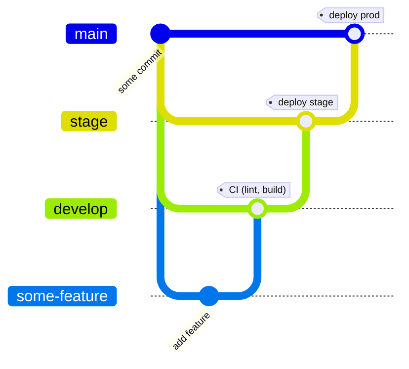

# Doge Hello World

[](https://github.com/martibosch/doge-hello-world/actions/workflows/ci.yml)
[](https://github.com/martibosch/doge-hello-world/actions/workflows/deploy.yml?query=branch%3Amain)
[](https://github.com/martibosch/doge-hello-world/blob/main/LICENSE)
[](https://github.com/martibosch/cookiecutter-doge)

Example app using the [Doge](https://github.com/martibosch/cookiecutter-doge) :dog2: workflow for continuous integration/deployment (CI/CD) to Digital Ocean.

## Requirements

### Software

* [GNU Make](https://www.gnu.org/software/make/)
* [terraform](https://www.terraform.io/)
* [git](https://git-scm.com/) >=2.28.0
* [pre-commit](https://pre-commit.com/)

Optional:

* [GitHub CLI](https://cli.github.com/) (if you want to create the GitHub repository from the terminal).

You can install all the software requirements using conda (or mamba) and the `environment.yaml` file provided in the root of the repository as follows:

```bash
conda env create -f environment.yaml
# and then work from the newly-created environment as in:
conda activate doge
```

### Accounts

* A DigitalOcean account. You can sign up using [my referral link](https://m.do.co/c/fcde1e9e1f62) to get $100 in credit.
* A GitHub account.
* A Terraform Cloud account and a Terraform Cloud organization. With an active account, you can create an organization by navigating to [app.terraform.io/app/organizations/new](https://app.terraform.io/app/organizations/new). You can also use an existing organization. This workflow is compatible with [the free plan](https://www.terraform.io/cloud-docs/overview).

## Steps

**ACHTUNG** :warning:: it is very important that the steps are followed **in the order** outlined below:

### 1. Create access tokens

The Doge :dog2: workflow requires three access tokens, which must be set as terraform variables in the `terraform/deploy/meta/vars.tfvars` file (**note** that to avoid disclosing sensitive information, this file is kept out of version control):

* **DigitalOcean**: navigate to [cloud.digitalocean.com/account/api/token/new](https://cloud.digitalocean.com/account/api/tokens/new) (you must be authenticated), choose a name and an expiration, click on "Generate Token" and copy the generated token as the value of the `do_token` variable.
* **GitHub**: navigate to [github.com/settings/tokens/new](https://github.com/settings/tokens/new) (you must be authenticated), choose a name, an expiration and select at least the `repo` and `workflow` permissions. Click on "Generate token" and copy the generated token as the value of the `gh_token` variable.
* **Terraform Cloud**: navigate to [app.terraform.io/app/settings/tokens](https://app.terraform.io/app/settings/tokens) and click on "Create an API token", provide a description, click on "Create API token" and copy the generated token as the value of the `tf_api_token` variable.

### 2. Initial infrastructure provisioning

The initial infrastructure provisioning in the Doge workflow is done by running Terraform locally with the help of GNU Make. This will set up the required GitHub infrastructure (notably [repository secrets](https://docs.github.com/en/actions/security-guides/encrypted-secrets)) so that the rest of the workflow is fully managed by GitHub Actions.

#### 2.1 Bootstraping Terraform Cloud workspaces

From the root of the generated project, use the following command to provision the meta workspace (i.e., a workspace to manage workspaces<sup>[1](#managing-workspaces-scale-factory), [2](#bootstraping-workspaces)):

```bash
make init-meta
```

At this point, if you navigate to [app.terraform.io/app/exaf-epfl/workspaces](https://app.terraform.io/app/exaf-epfl/workspaces), a workspace named `doge-hello-world-meta` should appear.

You can then plan and apply the Terraform setup as follows:

```bash
make plan-meta
make apply-meta
```

which will create three additional workspaces, named `doge-hello-world-base`, `doge-hello-world-stage` and `doge-hello-world-prod`.

#### 2.2 GitHub repository and base infrastructure

The GitHub repository can be created in two ways:

* *using the [GitHub CLI](https://cli.github.com/)* (*recommended*): first, make sure that you are properly authenticated with the GitHub CLI (use the [`gh auth login`](https://cli.github.com/manual/gh_auth_login) command). Then, from the root of the generated project, run `make create-repo`, which will automatically initialize a git repository locally, add the first commit, and push it to a GitHub repository at `martibosch/doge-hello-world`.

* *manually from the GitHub web interface*: navigate to [github.com/new](https://github.com/new), create a new empty repository at `martibosch/doge-hello-world`. Then, from the root of the generated project, initialize a git repository, setup pre-commit for the repository, add the first commit and push it to the new GitHub repository as follows:

	```bash
	git init --initial-branch=main  # this only works for git >= 2.28.0
	pre-commit install
	git add .
	SKIP=terraform_validate git commit -m "first commit"
	git branch -M main
	git remote add origin git@github.com:martibosch/doge-hello-world
	git push -u origin main
	```

Once the initial commit has been pushed to GitHub, use GNU Make to provision some base infrastructure:

```bash
make init-base
make plan-base
make apply-base
```

notably, a ssh key will be created and added to terraform, DigitalOcean (you can see a new item named `doge-hello-world` at [cloud.digitalocean.com/account/security](https://cloud.digitalocean.com/account/security), and [repository secrets](https://docs.github.com/en/actions/security-guides/encrypted-secrets#creating-encrypted-secrets-for-a-repository) (you can see a repository secret named `SSH_KEY` at [github.com/martibosch/doge-hello-world/settings/secrets/actions](https://github.com/martibosch/doge-hello-world/settings/secrets/actions)). Additionally, a DigitalOcean project (an item named `doge-hello-world` visible in the top-left "PROJECTS" menu of the web interface) will be created to group the resources used for this app.

#### 2.3 Staging and production infrastructure

The inital provisioning of the staging and production infrastructure must also be done using GNU Make following the Terraform init-plan-apply scheme, i.e., for the staging environment:

```bash
make init-stage
make plan-stage
make apply-stage
```

and for production:

```bash
make init-prod
make plan-prod
make apply-prod
```

If you navigate to [cloud.digitalocean.com](https://cloud.digitalocean.com) and select the `doge-hello-world` project, you will see that droplets named `doge-hello-world-stage` and `doge-hello-world-prod` have been created for each environment respectively. Additionally, at [github.com/martibosch/doge-hello-world/settings/secrets/actions](https://github.com/martibosch/doge-hello-world/settings/secrets/actions)), you will find an [environment secret](https://docs.github.com/en/actions/security-guides/encrypted-secrets#creating-encrypted-secrets-for-an-environment) named `DROPLET_HOST`, which contains the IPv4 address of the staging and production hosts respectively.

### 3. GitOps workflow for CI/CD

Once the initial infrastructure has been provisioned, CI/CD is ensured by the following GitOps workflow:

1. New features are pushed into a dedicated feature branch.
2. **develop**: a pull request (PR) to the `develop` branch is created, at which point [CI workflow](https://github.com/martibosch/doge-hello-world/blob/main/.github/workflows/ci.yaml) is run. If the CI workflow passes, the PR is merged, otherwise, fixes are provided in the feature branch until the CI workflow passes.
3. **stage**: once one or more feature PR are merged into the `develop` branch, they can be deployed to the staging environment by creating a PR to the `stage` branch, which will trigger the ["plan" workflow](https://github.com/martibosch/doge-hello-world/blob/main/.github/workflows/plan.yaml). If successful, the PR is merged, at which point the ["deploy" workflow](https://github.com/martibosch/doge-hello-world/blob/main/.github/workflows/deploy.yaml) is run, which will deploy the branch contents to the staging environment.
4. **main**: after a successful deployment to staging, a PR from the stage to the main branch will trigger the ["plan" workflow](https://github.com/martibosch/doge-hello-world/blob/main/.github/workflows/plan.yaml), yet this time for the production environment. Likewise, If the workflow passes, the PR can be merged, which will trigger the ["deploy" workflow](https://github.com/martibosch/doge-hello-world/blob/main/.github/workflows/deploy.yaml), which will deploy the branch contents to production.

Overall, the Doge :dog2: GitOps workflow can be represented as follows:



## Destroying infrastructure

The infrastructure provisioned by this setup can be destroyed using GNU Make as follows:

```bash
make destroy-prod
make destroy-stage
make destroy-base
make destroy-meta
```

## Footnotes

<a name="managing-workspaces-scale-factory">1</a>. ["Managing Workspaces With the TFE Provider at Scale Factory"](https://www.hashicorp.com/resources/managing-workspaces-with-the-tfe-provider-at-scale-factory)

<a name="managing-workspaces-scale-factory">2</a>. [response by chrisarcand in "Using variables with remote backend"](https://discuss.hashicorp.com/t/using-variables-with-remote-backend/24531/2)
